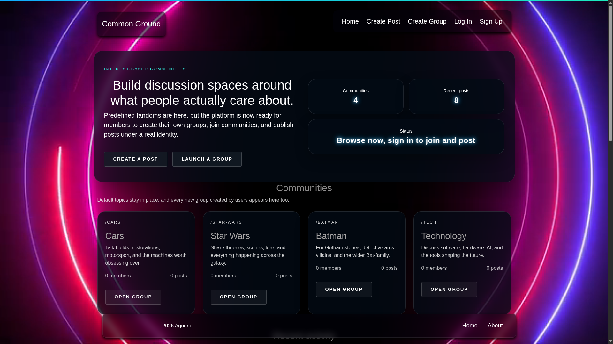
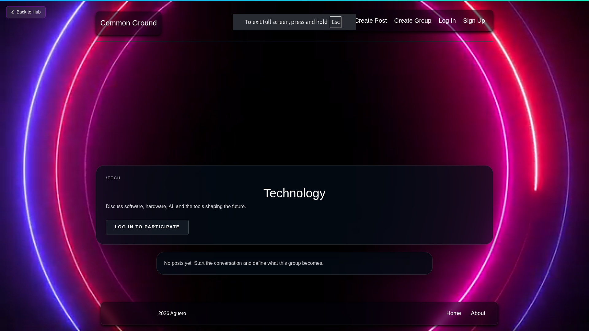

# Common Ground - Blog Web Application

An Express + EJS community platform where users create groups, publish posts, comment, and run full moderation workflows with PostgreSQL persistence.


## Project Core & Overview

### Project Title
Common Ground - Blog Web Application

### One-Line Pitch
Build and moderate interest-based communities with posts, comments, reporting, and role-based moderation in one server-rendered app.

### Visual Preview
Preview placeholder



 

Recommended upgrade: capture 1 screenshot of Home, 1 of Group page, and 1 GIF of moderation flow.

## Getting Started

### Prerequisites

- Node.js 18+ (Node 20+ recommended)
- npm 9+
- PostgreSQL 14+
- A local `.env.local` file with database/session values

### Installation

```bash
git clone <your-repository-url>
cd Blog-Web-Application
npm install
```

Create `.env.local`:

```bash
cat > .env.local << 'EOF'
DB_HOST=localhost
DB_PORT=5432
DB_NAME=blog_web_app
DB_USER=postgres
DB_PASSWORD=postgres
SESSION_SECRET=change-me
PORT=3000
EOF
```

Initialize database schema:

```bash
npm run db:init
```

Start app:

```bash
npm start
```

### Usage Examples

Run tests:

```bash
npm test
```

Run server in watch mode:

```bash
npm run server
```

Check deployment endpoints:

```bash
curl -s http://127.0.0.1:3000/health
curl -s http://127.0.0.1:3000/ready
```

## Advanced Operations

### Configuration

Core runtime variables:

- `PORT`: HTTP port (default `3000`)
- `SESSION_SECRET`: required in production
- `NODE_ENV`: use `production` for production mode
- `RUN_LEGACY_BACKFILL`: set `true` to run legacy post backfill on startup

Database variables:

- Hosted mode: `DATABASE_URL` (recommended for Vercel/Supabase)
- Local mode: `DB_HOST`, `DB_PORT`, `DB_NAME`, `DB_USER`, `DB_PASSWORD`
- Optional tuning: `DB_CONNECT_TIMEOUT_MS`, `DB_POOL_MAX`, `DB_SSL`

Optional Supabase session refresh:

- `NEXT_PUBLIC_SUPABASE_URL`
- `NEXT_PUBLIC_SUPABASE_PUBLISHABLE_KEY`

If Supabase is unavailable, middleware is fail-open and core app routes continue working.

### Testing

Full suite:

```bash
npm test
```

Focused moderation tests:

```bash
node --test --test-name-pattern='moderation page' tests/app.test.js
```

Focused readiness test:

```bash
node --test --test-name-pattern='health and readiness endpoints are available' tests/app.test.js
```

### Deployment / Readiness Checks

- `GET /health`: liveness probe
- `GET /ready`: readiness probe (database reachable and app initialized)

## Project Hygiene & Governance

### Contributing

Suggested contribution workflow:

1. Create a branch from `main`.
2. Branch naming: `feature/<short-name>`, `fix/<short-name>`, `chore/<short-name>`.
3. Keep pull requests focused and small.
4. Ensure `npm test` passes before opening a PR.
5. Include screenshots/GIFs for UI changes.

Coding style:

- Preserve existing Express/EJS patterns
- Prefer small, test-backed changes
- Avoid unrelated refactors in the same PR

### License

This project is distributed under the ISC license (as declared in `package.json`).

### Contact

- Open an issue in this repository for bugs or feature requests.
- Use pull requests for code contributions and improvements.
